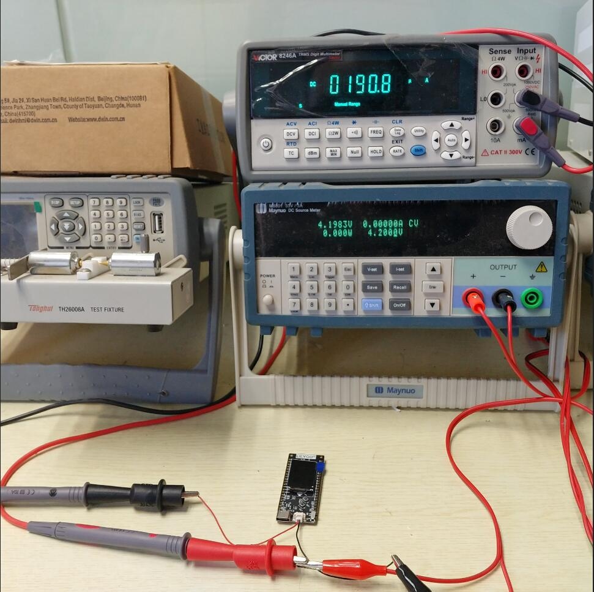

# LilyGo T-Display S2

1. Before using this project, please set up the esp-idf environment, specific reference [esp-idf-docs](https://docs.espressif.com/projects/esp-idf/en/latest/esp32s2/get-started/index.html)
2. Clone the project and then allow `idf.py build`
3. Use `idf.py -p [your port] -b 115200 flash` to download to the board

### Information for new users:
- IO14 is connected to the SD card of the board, and the power of the LED controls the IO Pin. When you use the battery, you need to set IO14 to high level to use the SD card.
- For power consumption, use this code, currently the lowest is 190uA
    

